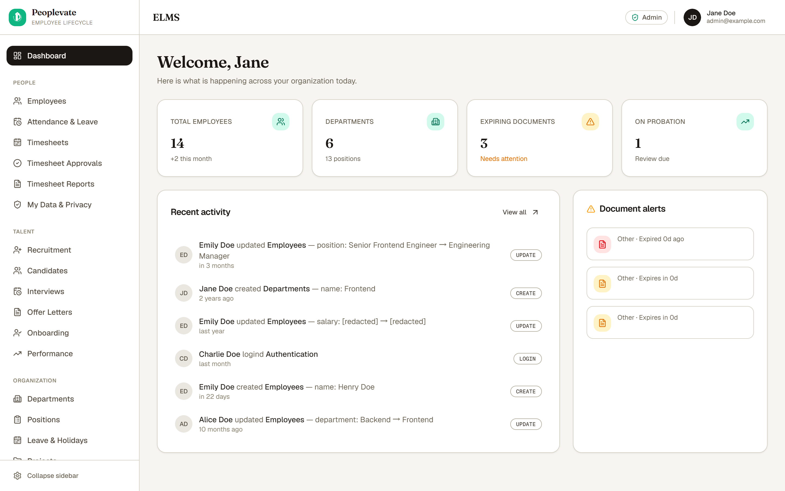
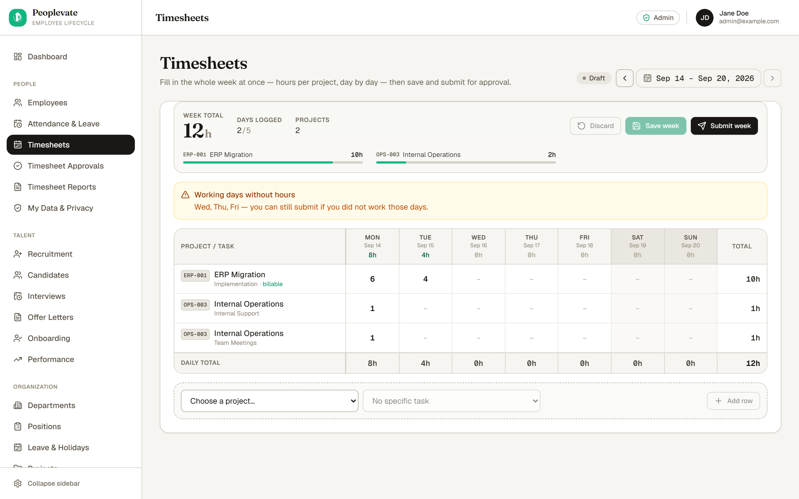
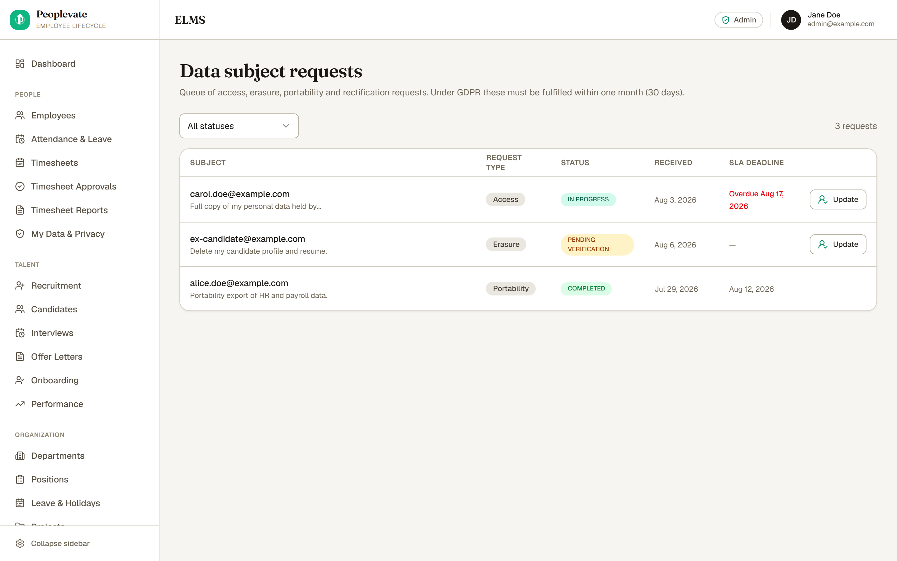
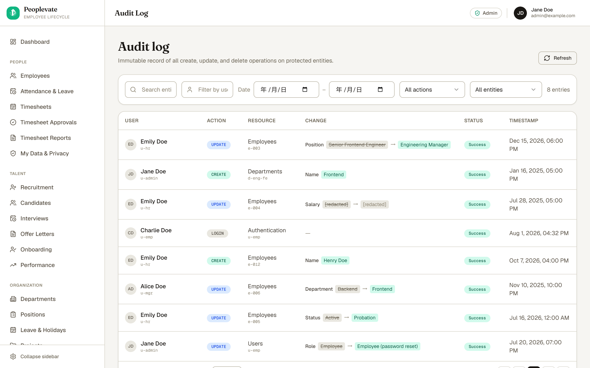
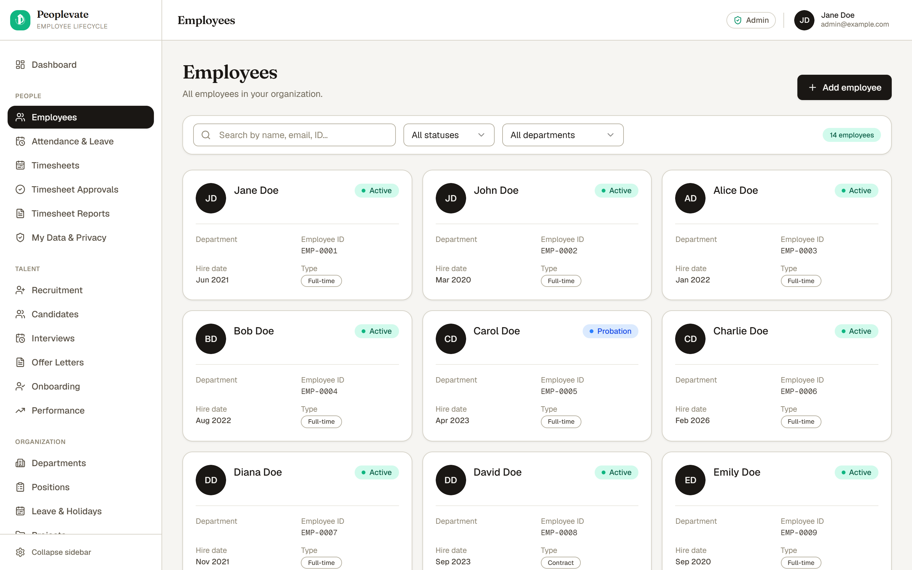
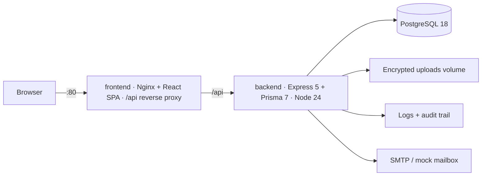

<div align="center">

# Peoplevate

### The self-hosted employee lifecycle platform for teams that must prove how employee data is handled.

**Recruit · Onboard · Track time · Review · Offboard** — one continuous employee record,
with encrypted PII, four-tier RBAC and a full audit trail, on your own infrastructure.

[**Try the live demo →**](https://orbivort.github.io/peoplevate/)

[](./LICENSE)
[](https://orbivort.github.io/peoplevate/)
[](https://github.com/orbivort/peoplevate/releases)
[](https://github.com/orbivort/peoplevate/actions/workflows/ci.yml)
[](https://codecov.io/github/orbivort/peoplevate)

</div>

<a href="https://orbivort.github.io/peoplevate/"></a>

> **Live demo — runs on mock data, no backend required.** Changes are local to your browser
> session and reset on reload.

---

## Table of Contents

- [Why Peoplevate?](#why-peoplevate)
- [A Quick Tour](#a-quick-tour)
- [About](#about)
- [Features](#features)
- [Prerequisites](#prerequisites)
- [Quick Start (Docker)](#quick-start-docker)
- [Getting Started (local development)](#getting-started-local-development)
- [Common Scripts](#common-scripts)
- [Environment Variables](#environment-variables)
- [Architecture](#architecture)
- [Security & Compliance](#security--compliance)
- [Documentation](#documentation)
- [Tech Stack](#tech-stack)
- [Repository Layout](#repository-layout)
- [Project Status](#project-status)
- [Contributing](#contributing)
- [License](#license)

---

## Why Peoplevate?

Most open-source HR software is an **assembly**: modules, add-ons and plugins for you to
integrate, configure and secure yourself. Peoplevate takes the opposite approach — **the whole
employee lifecycle in one data model, with compliance built in rather than bolted on.**

|                                 | Peoplevate                                                                                                                                                                                                                                                    |
| ------------------------------- | ------------------------------------------------------------------------------------------------------------------------------------------------------------------------------------------------------------------------------------------------------------- |
| **Lifecycle continuity**        | One employee record, continuously, from job requisition → offer → onboarding → attendance, timesheets & leave → performance review → offboarding & settlement. Every stage is a workflow with an approval path and an audit trail, not a standalone table.     |
| **Compliance by default**       | AES-256-GCM field encryption for PII and salary, GDPR data-subject rights with SLA tracking, retention policies with legal hold, a breach workflow with a 72-hour deadline, and consent evidence — in the base system, not a paid tier.                        |
| **Provable access control**     | Four-tier RBAC (ADMIN / HR_MANAGER / MANAGER / EMPLOYEE) enforced on the API **and** the UI, with account lockout, argon2 password hashing and rotating refresh tokens with reuse detection.                                                                     |
| **Auditable by design**         | Every create, update and delete is recorded — plus sensitive reads, downloads and exports — with anomaly detection for failed-login and bulk-download spikes. Salaries appear as `[redacted]` in the log, because plaintext is never stored.                    |
| **Yours to run**                | Three containers, one `docker compose up`, migrations applied on start, persistent volumes and health checks on every service. No vendor and no multi-tenant data store — the database, the encrypted documents and the audit log stay on your infrastructure.  |

**Choose Peoplevate if** you self-host, you need to answer "where exactly is our employees'
personal data, and who has seen it?", and you want the entire employee journey in one system.

## A Quick Tour

<table>
<tr>
<td width="50%" valign="top">

<strong>Timesheets</strong>
<br />
Weekly project × day grid, draft → submit → approve, with approval history and working-time reports.



</td>
<td width="50%" valign="top">

<strong>Data subject requests</strong>
<br />
GDPR access, erasure, portability and rectification requests tracked against a 30-day SLA.



</td>
</tr>
<tr>
<td width="50%" valign="top">

<strong>Audit log</strong>
<br />
An immutable record of every mutation, with before → after values and redacted salaries.



</td>
<td width="50%" valign="top">

<strong>Employees &amp; organization</strong>
<br />
Hierarchical departments, positions, encrypted PII and employment-change history.



</td>
</tr>
</table>

## About

Peoplevate is a self-hosted **employee lifecycle platform** that keeps **one continuous record** for
every employee — from the job requisition and offer, through onboarding, day-to-day attendance,
timesheets and leave, and performance reviews, to a structured offboarding and final settlement.

It is built on three commitments:

- **A clean layered architecture** — `routes → services → Prisma`, in strict-mode TypeScript.
- **Security that is on by default** — AES-256-GCM encryption of PII and salary at rest, JWT with
  rotating refresh tokens, and RBAC enforced on both the API and the UI.
- **Auditability you can prove** — every mutation, and every sensitive read, download or export,
  is written to the audit log.

## Features

### Core lifecycle

- **Recruitment → hire** — job requisitions with an approval workflow (draft → pending → approved →
  published → closed), postings, a candidate pipeline (APPLIED → SCREENING → INTERVIEW → OFFER →
  HIRED), interview scheduling and offer letters. _One funnel, one record — no spreadsheet hand-off._
- **Onboarding** — tasks for document submission, equipment assignment, orientation and system
  access setup. _New hires become productive and provably compliant from day one._
- **Attendance, timesheets & leave** — clock in/out with IP capture and configurable grace minutes;
  a managed project & task catalog; weekly (Mon–Sun) timesheets with a 24-hour daily cap, manager
  approval and email notifications; leave types, policy groups, entitlements and balances with a
  multi-step manager → HR approval flow; and holiday calendars. _All time data in one place, with
  role-scoped reporting and CSV export._

### Platform & governance

- **Performance** — evaluation cycles (probation / mid-year / end-year) with a self → manager → HR
  review workflow and optional rebuttals.
- **Offboarding** — clearance checklists, exit interviews, settlements and a full offboarding state
  machine (INITIATED → CLEARANCE_IN_PROGRESS → EXIT_INTERVIEW → SETTLEMENT → CLOSED).
- **Organization** — hierarchical departments, positions and employees with manager relationships,
  plus employment-change tracking (promotion, transfer, manager change, salary adjustment, status
  change) with before/after history.
- **Documents** — typed documents (contract, national ID, passport, …) with AES-encrypted PII,
  expiry tracking and automated expiry alerts.
- **Security & compliance** — JWT + rotating refresh tokens, argon2 password hashing, account
  lockout, rate limiting, four-tier RBAC, full audit logging, and GDPR data-subject rights,
  retention policies and breach notification. See [Security & Compliance](#security--compliance).
- **Automation** — scheduled jobs for document expiry, leave accrual, probation, deactivation,
  retention purge and DSAR SLA checks.

## Prerequisites

- **Docker Engine 24+** with Docker Compose v2 — recommended for self-hosting (see below)
- **Node.js** `^24` (local development)
- **pnpm** `^11` (local development; the repo pins `pnpm@11.21.0` via `packageManager`)
- **PostgreSQL** (>= 18 recommended) — only required for a non-Docker manual setup

## Quick Start (Docker)

Peoplevate ships a complete `docker-compose.yml` that bundles the database, backend and frontend
into a single self-hosted stack. See [`docs/deployment.md`](./docs/deployment.md) for the full
operating guide (configure, verify, back up, upgrade, harden).

```bash
# 1. Configure environment (secrets are REQUIRED — >= 32 chars)
cp .env.docker.example .env
#    edit .env: set POSTGRES_PASSWORD, JWT_SECRET, FIELD_ENCRYPTION_KEY

# 2. Build and start all three services
docker compose up -d --build

# 3. Verify — all services should report "healthy"
docker compose ps
curl http://localhost/healthz        # frontend (Nginx)
docker compose exec backend wget -qO- http://127.0.0.1:4000/health   # backend API
```

Open the app at <http://localhost>. The backend API is proxied at `/api`; its own health check is
at `/health`.

> **Note:** data lives in named volumes (`peoplevate-db-data`, `peoplevate-uploads`,
> `peoplevate-logs`) and survives `docker compose down`. Migrations run automatically on backend
> start. The frontend is the single public entrypoint — the database and backend ports bind to
> `127.0.0.1` only.

## Getting Started (local development)

```bash
# 1. Install dependencies
pnpm install

# 2. Configure environment
# Backend: copy .env.example -> .env (and .env.test)
#   Required: DATABASE_URL, JWT_SECRET (>= 32 chars), FIELD_ENCRYPTION_KEY (>= 32 chars)
# Frontend: copy .env.example -> .env.local
#   VITE_USE_MOCK=false enables the real API

# 3. Generate the Prisma client and create the schema
pnpm db:generate
pnpm db:migrate     # or: pnpm db:push

# 4. (Optional) Seed sample data
pnpm db:seed

# 5. Run the development servers (backend :4000, frontend :5173)
pnpm dev
```

Open the frontend at <http://localhost:5173>. The backend API lives at
<http://localhost:4000/api> with a health check at `/health`.

> **Note:** `pnpm dev:frontend` / `pnpm dev:backend` run each app individually. The frontend dev
> server proxies `/api` to `:4000`.

## Common Scripts

All scripts run from the repository root via pnpm.

| Command                                                          | Description                                                                     |
| ---------------------------------------------------------------- | ------------------------------------------------------------------------------- |
| `pnpm dev`                                                       | Run backend and frontend in watch mode                                          |
| `pnpm build`                                                     | Build both apps                                                                 |
| `pnpm typecheck`                                                 | Type-check both apps                                                            |
| `pnpm lint` / `pnpm lint:css`                                    | Lint TS/TSX and CSS                                                             |
| `pnpm format:check` / `pnpm format:write`                        | Check / apply Prettier formatting                                               |
| `pnpm test`                                                      | Run frontend + backend unit tests                                               |
| `pnpm test:coverage`                                             | Run unit tests with coverage                                                    |
| `pnpm test:integration`                                          | Run backend integration tests against a local Postgres                          |
| `pnpm test:e2e`                                                  | Run Playwright end-to-end tests (`pnpm test:e2e:install` once for browsers)     |
| `pnpm test:typecheck`                                            | Type-check the test suites                                                      |
| `pnpm db:*`                                                      | Prisma generate / migrate / push / seed / studio                                |
| `pnpm audit`                                                     | Audit dependencies via the npm registry                                         |
| `pnpm ci`                                                        | Full CI pass: typecheck, test typecheck, lint, CSS lint, format check, coverage |

## Environment Variables

Required backend vars (validated by zod at startup, which fails fast on invalid values):

- `DATABASE_URL` — PostgreSQL connection string
- `JWT_SECRET` — at least 32 characters
- `FIELD_ENCRYPTION_KEY` — at least 32 characters (AES-256 for PII/salary)

Frontend:

- `VITE_USE_MOCK` — set to `false` to use the real API instead of `data/mock-data.ts`
- `VITE_API_BASE` — optional API base URL override

## Architecture

Three services, one command — the full stack is defined in
[`docker-compose.yml`](./docker-compose.yml):



- **Layered backend** — `routes/` (HTTP + validation) → `services/` (business logic) →
  `config/prisma.ts`, with co-located `*.test.ts` files.
- **Entrypoints** — `index.ts` (bootstrap, cron lifecycle, graceful shutdown) and `app.ts`
  (`createApp()`, used by the test suite).
- **Database** — UUID primary keys, snake_case columns, `_at` suffixes on timestamps and soft
  deletes via `deleted_at`.

See [`docs/api-overview.md`](./docs/api-overview.md) for the REST reference.

## Security & Compliance

Security is a design constraint here, not a feature flag.

**Protecting data at rest and in transit**

- PII and salary are **encrypted at rest** with AES-256-GCM using `FIELD_ENCRYPTION_KEY`, with
  versioned key management and a legacy decryption fallback for older records.
- Plaintext passwords, salaries and national IDs are **never** logged or stored — salaries are
  rendered as `[redacted]` in the audit log.
- JWT secrets and encryption keys are environment-only, enforced to be ≥ 32 characters, and never
  committed.
- Helmet security headers (CSP/HSTS), CORS allow-listing and request body limits are applied by
  default; no source maps ship in production unless `VITE_SOURCEMAP=true`.

**Authentication and access control**

- 15-minute access tokens with 7-day **rotating** refresh tokens, hashed at rest, with reuse
  detection via token families.
- Account lockout after 5 failed attempts (15-minute cooldown) plus login rate limiting.
- RBAC enforced on both frontend routes and backend middleware — see
  [`docs/roles-permissions.md`](./docs/roles-permissions.md).

**Accountability**

- Every create, update and delete is audit-logged, alongside sensitive reads, downloads and
  exports, with anomaly detection for failed-login and bulk-download spikes.

**GDPR**

- Data subject rights (access, erasure, portability, rectification) with a request queue and SLA
  tracking, retention policies across eight data categories with hard-delete and anonymize actions,
  legal hold support, a breach notification workflow with a 72-hour deadline, consent management
  with evidence records, and IP data minimization.

To report a vulnerability, see our [SECURITY.md](./SECURITY.md) policy.

## Documentation

| Document                                             | Audience                               | Purpose                                                                             |
| ---------------------------------------------------- | -------------------------------------- | ----------------------------------------------------------------------------------- |
| [Usage Guide](./docs/usage-guide.md)                 | All users, HR, managers, admins        | How each functional module works, role-based workflows and frontend routes          |
| [Roles & Permissions](./docs/roles-permissions.md)   | Admins, HR managers, operators         | The RBAC role matrix and capability mapping across the system                       |
| [API Overview](./docs/api-overview.md)               | API consumers, integrators, developers | REST endpoint reference for the backend API                                         |
| [Deployment](./docs/deployment.md)                   | Operators, DevOps, admins              | Production deployment, including the recommended Docker Compose stack               |

## Tech Stack

### Backend (`packages/backend`)

[](./package.json)
[](./package.json)

- **Node.js 24** · **Express 5** · **TypeScript** (strict, ESM)
- **Prisma 7** with PostgreSQL 18
- JWT (15-min access / 7-day refresh, hashed refresh tokens), **argon2**, **zod**, helmet, CORS,
  rate limiting, multer, nodemailer, **winston** logging, **node-cron**
- Testing: **Vitest** + **supertest** (unit + integration)

### Frontend (`packages/frontend`)

- **React 19** · **TypeScript** · **Vite 8** · **Tailwind CSS v4**
- **Radix UI** primitives, **framer-motion**, **Formik**, **React Router 8**
- Testing: **Vitest** + **Testing Library**; **MSW** for API mocking

### End-to-end (`packages/e2e`)

- **Playwright** driven through a real browser against a real backend and seeded database

### Shared configs (`packages/config`)

- `@peoplevate/eslint-config` — shared ESLint flat config
- `@peoplevate/vitest-config` — shared Vitest base config

## Repository Layout

```
packages/
  backend/   @peoplevate/backend  — Express 5 + Prisma 7 API (ESM)
  frontend/  @peoplevate/frontend — React 19 + Vite SPA
  e2e/       @peoplevate/e2e      — Playwright end-to-end tests
  config/    shared eslint-config + vitest-config
docs/        engineering, deployment and compliance documentation
```

## Project Status

**v1.1.0 — actively maintained.** The v1.0 release delivered full lifecycle coverage with
enterprise-grade security and GDPR tooling; v1.1.0 added timesheets with manager approval and
working-time reports. See [CHANGELOG.md](./CHANGELOG.md) and
[Releases](https://github.com/orbivort/peoplevate/releases) for what has shipped, or open an issue
to propose what comes next.

## Contributing

Contributions are welcome — see [CONTRIBUTING.md](./CONTRIBUTING.md) for development setup,
conventions and the release process, and our [Code of Conduct](./CODE_OF_CONDUCT.md) for
community expectations. Run `pnpm ci` before opening a pull request.

## License

This project is licensed under the **Apache License 2.0** (SPDX: `Apache-2.0`). See the
[LICENSE](./LICENSE) file for details.
